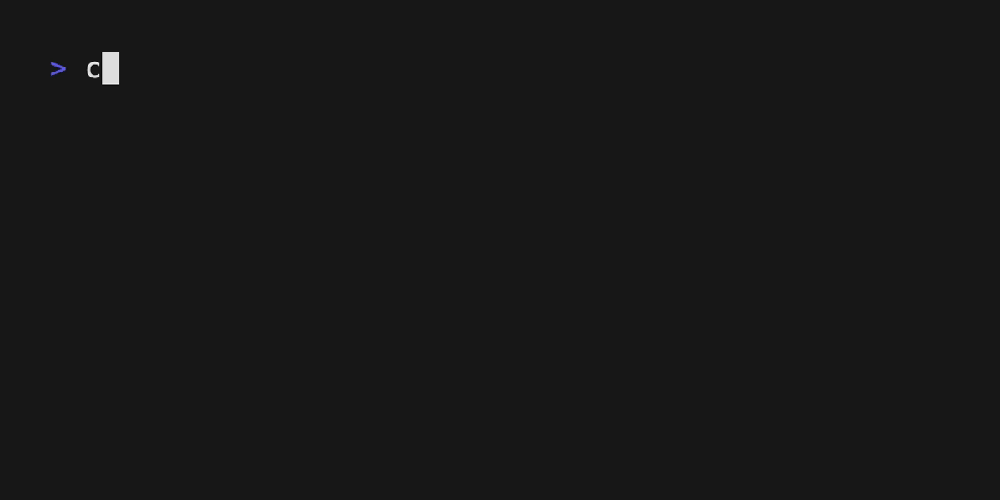

# Chat Example

A terminal-based chat interface built with bubbletea-rs, demonstrating how to create a scrollable message view with text input.



## Features

- 📜 **Scrollable message viewport** - Displays chat history with automatic scroll-to-bottom
- ⌨️ **Single-line text input** - With placeholder text "Send a message..."
- 📱 **Responsive layout** - Automatically adjusts to terminal size changes
- 🎨 **Styled messages** - Sender labels with custom colors
- ↩️ **Smart text wrapping** - Messages wrap to fit terminal width

## Running the Example

```bash
# From the repository root
cargo run --example chat

# Or from this directory
cargo run
```

### Controls
- **Type** to compose a message
- **Enter** to send the message
- **Esc** or **Ctrl+C** to quit

## Implementation Guide

### Core Components

This example uses two main widgets from `bubbletea-widgets`:

1. **`viewport::Model`** - Displays scrollable message history
2. **`textinput::Model`** - Handles user input with placeholder text

### Setting Up the Text Input

```rust
use bubbletea_widgets::textinput;

// Initialize with placeholder and prompt
let mut input = textinput::new();
input.set_placeholder("Send a message...");
input.prompt = "┃ ".to_string();  // Vertical bar prompt
input.set_char_limit(280);         // Optional character limit
input.set_width(terminal_width as i32);

// Focus to enable immediate typing
let _ = input.focus();
```

### Creating the Message Viewport

```rust
use bubbletea_widgets::viewport;

// Calculate viewport height (terminal height - input - gap)
let viewport_height = terminal_height
    .saturating_sub(1)  // Input height
    .saturating_sub(2)  // Gap between viewport and input
    .max(1);

let mut vp = viewport::new(terminal_width, viewport_height);
vp.set_content("Welcome to the chat!");
```

### Layout Structure

The layout consists of three parts:

```
┌─────────────── Viewport ───────────────┐
│ Welcome to the chat!                   │
│ You: Hello, world!                     │
│ You: How are you today?                │
└─────────────────────────────────────────┘
                                          
                                          
┃ Send a message...                       
```

The gap between viewport and input is created with two newlines (`\n\n`).

### Handling Messages

```rust
impl Model for ChatModel {
    fn update(&mut self, msg: Msg) -> Option<Cmd> {
        if let Some(key) = msg.downcast_ref::<KeyMsg>() {
            match key.key {
                KeyCode::Enter => {
                    let value = self.textinput.value();
                    if !value.trim().is_empty() {
                        // Add message with styled sender
                        let sender = Style::new()
                            .foreground(Color::from("5"))
                            .render("You: ");
                        self.messages.push(format!("{}{}", sender, value));
                        
                        // Update viewport with wrapped content
                        let content = self.wrap_messages();
                        self.viewport.set_content(&content);
                        self.viewport.goto_bottom();
                        
                        // Clear input
                        self.textinput.set_value("");
                    }
                    return None;
                }
                _ => {}
            }
        }
        
        // Pass other messages to textinput
        self.textinput.update(msg)
    }
}
```

### Responsive Resizing

Handle terminal resize events to maintain layout:

```rust
if let Some(ws) = msg.downcast_ref::<WindowSizeMsg>() {
    // Update input width
    self.textinput.set_width((ws.width - 2) as i32);
    
    // Recalculate viewport dimensions
    let viewport_height = ws.height
        .saturating_sub(1)  // Input height
        .saturating_sub(2); // Gap
    
    // Recreate viewport with new size
    let mut new_vp = viewport::new(ws.width, viewport_height);
    new_vp.set_content(&self.wrap_messages());
    new_vp.goto_bottom();
    self.viewport = new_vp;
}
```

### Text Wrapping

Implement word wrapping for long messages:

```rust
fn wrap_text(text: &str, width: usize) -> String {
    let mut lines = Vec::new();
    for paragraph in text.split('\n') {
        let mut line = String::new();
        for word in paragraph.split_whitespace() {
            if line.len() + word.len() + 1 > width {
                lines.push(std::mem::take(&mut line));
            }
            if !line.is_empty() {
                line.push(' ');
            }
            line.push_str(word);
        }
        lines.push(line);
    }
    lines.join("\n")
}
```

## Multi-line Text Input

If you need multi-line input (like Slack or Discord), you can use `textarea` instead:

### Using TextArea for Multi-line Input

```rust
use bubbletea_widgets::textarea;

let mut ta = textarea::new();
ta.set_height(3);  // 3 lines visible
ta.set_width(terminal_width);

// For multi-line, you might want a different send mechanism
// For example: Ctrl+Enter to send, Enter for new line
```

### Custom Multi-line Implementation

For a custom multi-line input similar to the one in `examples/textarea/`:

```rust
struct TextArea {
    lines: Vec<String>,
    cursor_row: usize,
    cursor_col: usize,
    height: usize,
    placeholder: String,
}

impl TextArea {
    fn view(&self) -> String {
        if self.is_empty() && !self.focused {
            // Show placeholder
            return format!("┃ {}", self.placeholder);
        }
        
        // Show lines with cursor
        let visible_lines = self.get_visible_lines();
        visible_lines
            .iter()
            .enumerate()
            .map(|(i, line)| {
                if i == self.cursor_row {
                    // Insert cursor
                    format!("┃ {}", line)
                } else {
                    format!("┃ {}", line)
                }
            })
            .collect::<Vec<_>>()
            .join("\n")
    }
}
```

### Switching Between Single and Multi-line

You could make the input mode switchable:

```rust
enum InputMode {
    SingleLine(textinput::Model),
    MultiLine(textarea::Model),
}

// Toggle with a key combination
KeyCode::Char('m') if modifiers.contains(KeyModifiers::ALT) => {
    self.input_mode = match self.input_mode {
        InputMode::SingleLine(input) => {
            let mut ta = textarea::new();
            ta.set_value(&input.value());
            InputMode::MultiLine(ta)
        }
        InputMode::MultiLine(ta) => {
            let mut input = textinput::new();
            input.set_value(&ta.lines().join(" "));
            InputMode::SingleLine(input)
        }
    };
}
```

## Styling with lipgloss

Use `lipgloss-extras` for rich text styling:

```rust
use lipgloss_extras::lipgloss::{Style, Color};

// Create styles for different message types
let user_style = Style::new()
    .foreground(Color::from("5"))      // Magenta
    .bold(true);

let system_style = Style::new()
    .foreground(Color::from("3"))      // Yellow
    .italic(true);

let error_style = Style::new()
    .foreground(Color::from("1"))      // Red
    .background(Color::from("52"))     // Dark red background
    .padding(1);

// Apply styles
let styled_message = user_style.render("You: ");
```

## Advanced Features

### Message History with Scrolling

To add scrollable history beyond viewport size:

```rust
struct ChatModel {
    messages: Vec<String>,      // All messages
    viewport: viewport::Model,  // Current view
    scroll_offset: usize,       // Current scroll position
}

// Allow scrolling with arrow keys
KeyCode::Up => {
    if self.scroll_offset > 0 {
        self.scroll_offset -= 1;
        self.update_viewport();
    }
}
KeyCode::Down => {
    if self.scroll_offset < self.messages.len() {
        self.scroll_offset += 1;
        self.update_viewport();
    }
}
```

### Timestamps and Message Metadata

```rust
struct Message {
    sender: String,
    content: String,
    timestamp: chrono::DateTime<chrono::Local>,
    is_system: bool,
}

impl Message {
    fn render(&self, width: usize) -> String {
        let time = self.timestamp.format("%H:%M").to_string();
        let sender_style = if self.is_system {
            Style::new().foreground(Color::from("8"))
        } else {
            Style::new().foreground(Color::from("5"))
        };
        
        format!("[{}] {}: {}", 
            time,
            sender_style.render(&self.sender),
            self.content
        )
    }
}
```

### Input Validation

```rust
// Character limit with visual feedback
fn update_input(&mut self, key: KeyCode) {
    let current_len = self.textinput.value().len();
    let limit = 280;
    
    if current_len >= limit {
        // Show warning
        self.input_style = Style::new()
            .foreground(Color::from("1")); // Red
    } else {
        self.input_style = Style::new()
            .foreground(Color::from("7")); // Default
    }
}
```

## Testing

Run the integration tests:

```bash
cargo test --example chat
```

## Troubleshooting

### Input not working
- Ensure `textinput.focus()` is called during initialization
- Check that key events are being passed to `textinput.update()`

### Layout issues
- Terminal size might be 0x0 initially - use `window_size()` command
- Account for prompt width when setting input width: `width - 2`

### Text wrapping problems
- Consider unicode width for proper character counting
- Handle very long words that exceed terminal width

## Next Steps

- Add message persistence with SQLite
- Implement network messaging with WebSockets
- Add emoji support with unicode rendering
- Create chat rooms/channels functionality
- Add typing indicators
- Implement message editing/deletion
- Add file sharing capabilities

## Dependencies

```toml
[dependencies]
bubbletea-rs = "0.0.6"
bubbletea-widgets = "0.1.6"
lipgloss-extras = { version = "0.0.8", features = ["full"] }
crossterm = "0.29"
tokio = { version = "1", features = ["full"] }
```

## License

See the main repository LICENSE file.