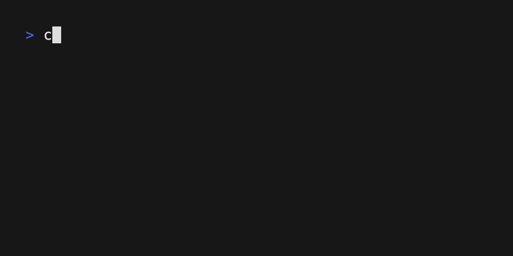

# Debounce



A demonstration of command debouncing in bubbletea-rs, showing how to handle rapid user input by delaying actions until activity stops.

## Features

- **Debounced Exit**: Program only exits after 1 second of inactivity
- **Input Counter**: Displays total number of key presses
- **Custom Messages**: Shows how to create and handle custom message types
- **Timer-based Logic**: Uses `tick()` commands for delayed execution

## Running the Example

From the repository root:

```bash
cargo run --example debounce
```

## What this demonstrates

### Key Concepts for Beginners

**Debouncing** is a programming technique to limit how often a function executes. In this example, the program waits for the user to stop pressing keys before exiting, preventing accidental quits during rapid typing.

### Public API Usage

**Core Framework:**
```rust
use bubbletea_rs::{quit, tick, Cmd, KeyMsg, Model, Msg, Program};
```

- `Model` trait: Defines the application structure
- `Msg` trait object: Type-erased messages for communication
- `tick()` function: Creates delayed command execution
- `quit()` function: Graceful program termination

**Custom Message Types:**
```rust
#[derive(Debug)]
pub struct ExitMsg(pub i32);  // Custom message with tag value
```

### Architecture Walkthrough

#### Model Structure
```rust
pub struct DebounceModel {
    pub tag: i32,  // Incremented on each keypress for debounce tracking
}
```

The `tag` field implements the debouncing mechanism by tracking the "generation" of input events.

#### Debouncing Logic

1. **User Input**: Any key press increments `model.tag`
2. **Schedule Exit**: A timer is set with the current tag value
3. **Validation**: When timer fires, compare message tag with current model tag
4. **Decision**: If tags match, no new input occurred → safe to exit

```rust
// On keypress: increment tag and schedule exit
if let Some(_key_msg) = msg.downcast_ref::<KeyMsg>() {
    self.tag += 1;
    let current_tag = self.tag;
    
    return Some(tick(DEBOUNCE_DURATION, move |_| {
        Box::new(ExitMsg(current_tag)) as Msg
    }));
}

// On timer: check if still valid
if let Some(exit_msg) = msg.downcast_ref::<ExitMsg>() {
    if exit_msg.0 == self.tag {  // No new input since timer started
        return Some(quit());
    }
    // Otherwise ignore - newer timer is coming
}
```

### Rust-Specific Patterns

**Message Downcasting:**
```rust
msg.downcast_ref::<KeyMsg>()     // Check if message is a KeyMsg
msg.downcast_ref::<ExitMsg>()    // Check if message is our custom ExitMsg
```

Unlike Go's type switches, Rust uses `downcast_ref()` to safely check message types at runtime.

**Trait Object Creation:**
```rust
Box::new(ExitMsg(current_tag)) as Msg
```

Custom messages must be boxed and cast to the `Msg` trait object for the messaging system.

**Closure Captures:**
```rust
let current_tag = self.tag;  // Capture by value for move closure
tick(duration, move |_| { ... })  // move ownership into async closure
```

### Common Patterns Explained

**Why use tags instead of canceling timers?**
- Simpler than timer cancellation
- Multiple pending timers naturally resolve themselves
- Only the latest timer's message matches the current tag

**Initial Render Trigger:**
```rust
struct InitRenderMsg;

fn init_render_cmd() -> Cmd {
    Box::pin(async { Some(Box::new(InitRenderMsg) as Msg) })
}
```

Some examples need this pattern to trigger the first `view()` render immediately.

### Program Configuration

```rust
let program = Program::<DebounceModel>::builder()
    .signal_handler(true)  // Enable Ctrl+C handling
    .alt_screen(false)     // Stay in normal terminal mode
    .build()?;
```

The builder pattern configures program behavior before running.

## Related Examples

- **[simple](../simple/)** - Basic timer and keyboard handling
- **[timer](../timer/)** - More advanced timer usage with widgets
- **[result](../result/)** - Another pattern for delayed program termination

## Files

- `main.rs` — Complete debounce implementation
- `Cargo.toml` — Dependencies and build configuration  
- `debounce.gif` — Demo recording
- `README.md` — This documentation