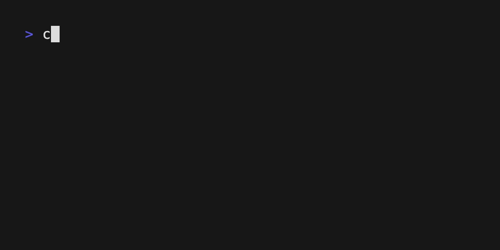

# Fullscreen



A demonstration of alternate screen buffer usage, showing how to create fullscreen terminal applications that temporarily take over the entire terminal without affecting existing content.

## Features

- **Alternate Screen Buffer**: Takes over entire terminal, restores original content on exit
- **5-Second Countdown**: Simple timer demonstration with automatic termination
- **Multiple Quit Options**: Exit early with `q`, `Esc`, or `Ctrl+C`
- **Clean Restoration**: Original terminal content perfectly restored after exit

## Running the Example

From the repository root:

```bash
cargo run --example fullscreen
```

**Controls:**
- `q` / `Esc` / `Ctrl+C` - Quit early
- Wait 5 seconds for automatic exit

## What this demonstrates

### Key Concepts for Beginners

**Alternate Screen Buffer**: Modern terminals have two screen buffers:
1. **Primary Buffer**: Normal terminal with scrollback history
2. **Alternate Buffer**: Full-screen overlay that doesn't affect primary content

Applications like `vim`, `htop`, and `less` use the alternate buffer to provide full-screen interfaces while preserving your terminal session.

### Public API Usage

**Core Framework:**
```rust
use bubbletea_rs::{quit, tick, Cmd, KeyMsg, Model, Msg, Program};
```

- `tick()`: Single-shot timer for countdown implementation
- Standard MVU pattern with custom message types

**Program Configuration:**
```rust
let program = Program::<FullscreenModel>::builder()
    .alt_screen(true)  // KEY FEATURE: Enable alternate screen buffer
    .build()?;
```

The `.alt_screen(true)` setting is what enables fullscreen mode.

### Architecture Walkthrough

#### Model Structure
```rust
pub struct FullscreenModel {
    pub count: i32,        // Countdown timer value
    pub keys: KeyBindings, // Organized keyboard shortcuts
}
```

#### Timer Implementation
```rust
// Initialize with first timer
let cmd = tick(Duration::from_secs(1), |_| Box::new(TickMsg) as Msg);

// In update loop - single-shot timers prevent accumulation
if msg.downcast_ref::<TickMsg>().is_some() {
    self.count -= 1;
    
    if self.count <= 0 {
        return Some(quit());  // Exit when countdown reaches 0
    }
    
    // Schedule next single tick (not continuous timer)
    return Some(tick(Duration::from_secs(1), |_| Box::new(TickMsg) as Msg));
}
```

### Rust-Specific Patterns

**Custom Message Types:**
```rust
#[derive(Debug)]
pub struct TickMsg;  // Unit struct for simple timer events
```

**Multiple Quit Keys:**
```rust
quit: new_binding(vec![
    with_keys_str(&["q", "esc", "ctrl+c"]),  // Multiple key options
    with_help("q/esc/ctrl+c", "quit"),
]),
```

**Timer Management:**
```rust
// GOOD: Single-shot timer, re-armed each time
tick(Duration::from_secs(1), |_| Box::new(TickMsg) as Msg)

// AVOID: Continuous timer that could accumulate
// every(Duration::from_secs(1), |_| Box::new(TickMsg) as Msg)
```

### Alternate Screen Buffer Details

**What happens when .alt_screen(true):**

1. **Program Start**: Terminal switches to alternate buffer
2. **Full Screen**: Application has complete control over display
3. **User Interaction**: Normal keyboard/mouse input works
4. **Program Exit**: Terminal automatically restores primary buffer

**Before running the program:**
```
$ ls
file1.txt  file2.txt  examples/
$ cargo run --example fullscreen
```

**During program execution:**
```
┌─────────────────────────────────────┐
│                                     │
│                                     │
│     Hi. This program will exit in   │
│     3 seconds...                    │
│                                     │
│                                     │
└─────────────────────────────────────┘
```

**After program exits:**
```
$ ls
file1.txt  file2.txt  examples/
$ cargo run --example fullscreen
$ █  # Cursor exactly where you left off
```

### Terminal Compatibility

**✅ Full Support:**
- iTerm2, Alacritty, Windows Terminal
- GNOME Terminal, Konsole
- Terminal.app (macOS)

**⚠️ Limited Support:**
- Some SSH sessions
- Very basic terminal emulators

**Graceful Fallback:**
```rust
// The framework handles terminals without alt-screen support gracefully
// Programs still work, just without the fullscreen isolation
```

### Common Use Cases

**Full-Screen Applications:**
- Text editors (vim, nano)
- System monitors (htop, top)
- Interactive menus and forms
- Games and visualizations

**Benefits:**
- No interference with existing terminal content
- Clean, distraction-free interface
- Professional application appearance
- User's work environment preserved

### Program Flow

1. **Initialization**: Switch to alt-screen, start countdown
2. **Update Loop**: Decrement counter every second
3. **Input Handling**: Allow early exit with multiple keys
4. **Termination**: Restore original screen automatically

### View Implementation

```rust
fn view(&self) -> String {
    format!(
        "\n\n     Hi. This program will exit in {} seconds...",
        self.count
    )
}
```

Simple centered display - the alternate screen buffer provides the clean canvas.

### Error Handling

The program handles termination gracefully:
```rust
program.run().await?;  // Framework ensures proper screen restoration
```

Even if the program panics, the terminal screen will be properly restored.

## Related Examples

- **[altscreen-toggle](../altscreen-toggle/)** - Dynamic alternate screen switching
- **[simple](../simple/)** - Basic timer without fullscreen
- **[exec](../exec/)** - Another example using alternate screen features

## Files

- `main.rs` — Complete fullscreen implementation with timer
- `Cargo.toml` — Dependencies and build configuration
- `fullscreentape.gif` — Demo recording showing screen transition
- `README.md` — This documentation

## Implementation Tips

- Always use `.alt_screen(true)` for fullscreen applications
- Test in various terminal emulators for compatibility
- Provide clear exit instructions to users
- Consider responsive design for different terminal sizes
- The framework handles screen restoration automatically, even on crashes