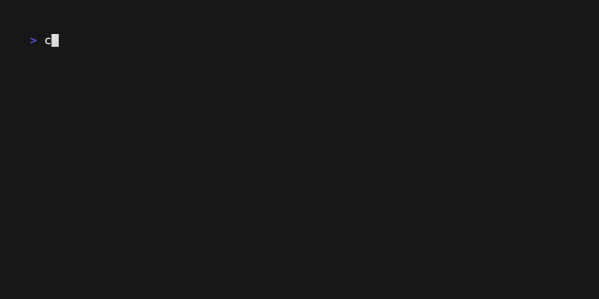

# Paginator Example



A simple program demonstrating the paginator component from the bubbletea-widgets library.

This example shows how to use a standalone paginator widget to navigate through a list of items. It matches the functionality of the original Go Bubble Tea paginator example.

## Features

- 100 items displayed 10 per page
- Dot-style pagination  
- Navigation with h/l keys or left/right arrow keys
- Custom styled dots matching Go's lipgloss styling

## Running

```bash
cargo run -p paginator-example
```

## Usage

- Use `h` or `←` to go to the previous page
- Use `l` or `→` to go to the next page  
- Use `q`, `ESC`, or `Ctrl+C` to quit

## Developer Guide: Creating Pagination

This example demonstrates how to implement pagination in your TUI applications using the bubbletea-widgets paginator component.

### 1. Basic Setup

First, add the required dependencies to your `Cargo.toml`:

```toml
[dependencies]
bubbletea-rs = "0.0.9"
bubbletea-widgets = "0.1.12"
lipgloss-extras = { version = "0.1.1", features = ["full"] }
crossterm = "0.29"
tokio = { version = "1.0", features = ["full"] }
```

### 2. Import Required Types

```rust
use bubbletea_rs::{Cmd, KeyMsg, Model as BubbleTeaModel, Msg, Program};
use bubbletea_widgets::paginator::{Model as Paginator, Type};
use crossterm::event::{KeyCode, KeyModifiers};
use lipgloss_extras::lipgloss::{Color, Style};
```

### 3. Create Your Model

Your model should contain both your data and the paginator:

```rust
pub struct Model {
    items: Vec<String>,        // Your data
    paginator: Paginator,      // The paginator widget
}
```

### 4. Initialize the Paginator

```rust
fn new_model() -> Model {
    // Create your data
    let items = (1..=100).map(|i| format!("Item {}", i)).collect();

    // Configure the paginator
    let mut paginator = Paginator::new();
    paginator.paginator_type = Type::Dots;  // or Type::Arabic for numbers
    paginator.set_per_page(10);             // Items per page
    paginator.set_total_items(items.len()); // Total number of items
    
    // Optional: Custom styling
    let active_style = Style::new().foreground(Color::from("252"));
    let inactive_style = Style::new().foreground(Color::from("238"));
    paginator.active_dot = active_style.render("•");
    paginator.inactive_dot = inactive_style.render("•");

    Model { items, paginator }
}
```

### 5. Handle Updates

In your `update` method, pass messages to the paginator for navigation:

```rust
fn update(&mut self, msg: Msg) -> Option<Cmd> {
    // Handle your custom key bindings first
    if let Some(key_msg) = msg.downcast_ref::<KeyMsg>() {
        match key_msg.key {
            KeyCode::Char('q') | KeyCode::Esc => {
                return Some(bubbletea_rs::quit());
            }
            _ => {}
        }
    }

    // Let paginator handle navigation (h/l, arrows)
    self.paginator.update(&msg);
    None
}
```

### 6. Render with Pagination

In your `view` method, use `get_slice_bounds` to display the correct page:

```rust
fn view(&self) -> String {
    let mut output = String::new();
    
    // Get the items for the current page
    let (start, end) = self.paginator.get_slice_bounds(self.items.len());
    
    // Display current page items
    for item in &self.items[start..end] {
        output.push_str(&format!("  • {}\n", item));
    }
    
    // Display the paginator
    output.push_str(&format!("  {}\n", self.paginator.view()));
    output.push_str("  h/l ←/→ page • q: quit\n");
    
    output
}
```

### 7. Pagination Types

The paginator supports two display types:

- **`Type::Dots`**: Shows dots (• • ● • •) for page navigation
- **`Type::Arabic`**: Shows numbers (1 2 [3] 4 5) for page navigation

### 8. Key Navigation

The paginator automatically handles these keys:
- `h` / `←` (Left Arrow): Previous page
- `l` / `→` (Right Arrow): Next page

### 9. Advanced Usage

For more complex scenarios, you can:

```rust
// Get current page info
let current_page = self.paginator.page;
let total_pages = self.paginator.total_pages();
let items_per_page = self.paginator.per_page;

// Manually navigate
self.paginator.next_page();
self.paginator.prev_page();
self.paginator.page = 2; // Go to specific page

// Check bounds
let on_first_page = self.paginator.on_first_page();
let on_last_page = self.paginator.on_last_page();
```

### 10. Integration with Lists

You can also use pagination with the List widget:

```rust
use bubbletea_widgets::list::{Model as List, DefaultItem, DefaultDelegate};
use bubbletea_widgets::paginator::Type as PaginatorType;

let list = List::new(items, DefaultDelegate::new(), 80, 24)
    .with_pagination_type(PaginatorType::Dots)
    .with_show_pagination(true);
```

This approach gives you built-in pagination without manually managing slice bounds.

## API Reference

Key methods on `paginator::Model`:

- `new()` - Create a new paginator
- `set_per_page(usize)` - Set items per page
- `set_total_items(usize)` - Set total number of items
- `get_slice_bounds(usize) -> (usize, usize)` - Get start/end indices for current page
- `update(&Msg)` - Handle navigation messages
- `view() -> String` - Render the paginator
- `next_page()` / `prev_page()` - Manual navigation
- `total_pages() -> usize` - Get total page count