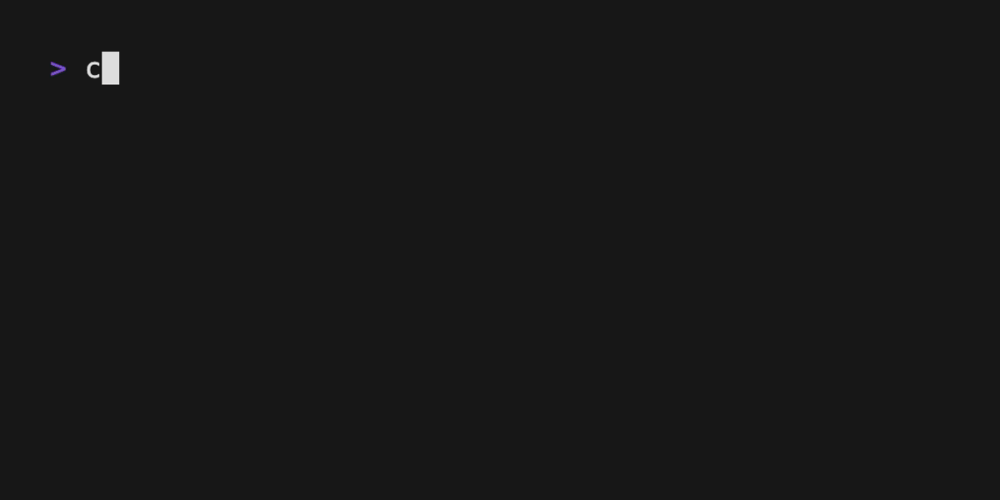

# Table Example



A demonstration of a scrollable table displaying population data for the world's largest cities.

## Features

- **Data Display**: Shows rank, city name, country, and population for 100 world cities
- **Navigation**: 
  - `↑`/`k`: Move selection up
  - `↓`/`j`: Move selection down  
  - `Home`: Jump to first row
  - `End`: Jump to last row
- **Interaction**:
  - `Enter`: Display "Let's go to [city]!" message (press any key to exit)
  - `Esc`: Toggle focus (changes selection highlighting)
  - `q`/`Ctrl+C`: Quit application
- **Visual**: Fixed 7-row viewport with scrolling, styled headers and selection highlighting

## Running

```bash
cargo run --example table
# or from the table directory:
cd examples/table && cargo run
```

## Implementation

This example demonstrates:
- Using `lipgloss-extras::table` for table rendering
- Keyboard navigation and selection handling
- Fixed-height scrollable viewport
- Custom styling to match the original Go Bubble Tea table example
- Focus state management affecting visual appearance

The table displays the same city population data as the original Go example, maintaining consistent behavior and styling.