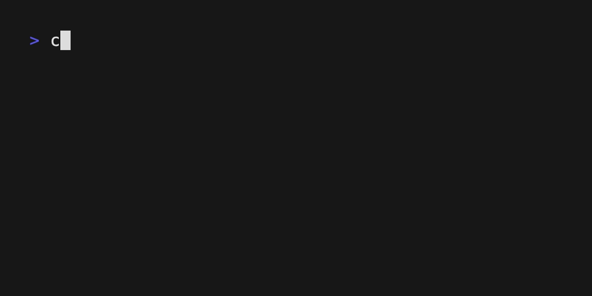

# Timer



A minimal countdown timer built with `bubbletea-rs`. It mirrors the Go Bubble Tea example `bubbletea/examples/timer`:

- 5s countdown that starts automatically
- Toggle start/stop with `s`
- Reset to full timeout with `r`
- Quit with `q`, `Esc`, or `Ctrl+C`

## Run

From the repository root:

```bash
cargo run -p timer
```

## What this demonstrates

- Scheduling periodic updates with a millisecond `tick` command
- Time-based state updates using `Instant` and `Duration`
- Handling keyboard input to start/stop/reset
- Quitting automatically when the timer reaches zero

## How it works (at a glance)

- The model stores `remaining: Duration`, a `running` flag, and the `last_tick: Option<Instant>`
- On each `TimerTickMsg`, compute the elapsed time since the last tick and subtract it from `remaining`
- When `remaining` reaches zero, the program quits
- Key handling:
  - `s`: toggles running state
  - `r`: resets `remaining` to the full timeout
  - `q`/`Esc`/`Ctrl+C`: quits immediately

## Using this in your own codebase

1. Define a message for ticks, e.g. `struct TimerTickMsg;`
2. Store `remaining: Duration`, `running: bool`, and `last_tick: Option<Instant>` in your model
3. Create a helper to schedule ticks:
   ```rust
   fn tick_cmd() -> Cmd { tick(Duration::from_millis(1), |_| Box::new(TimerTickMsg) as Msg) }
   ```
4. In `init`, if you want the timer to start immediately, set `running = true`, set `last_tick = Some(Instant::now())`, and return `Some(tick_cmd())`
5. In `update`:
   - On `TimerTickMsg`, if `running`, compute elapsed time since `last_tick`, subtract it from `remaining`, update `last_tick`, and schedule another `tick_cmd()` if not timed out
   - On key messages, implement start/stop (`s`), reset (`r`), and quit (`q`/`Esc`/`Ctrl+C`)
6. In `view`, render the remaining time or a completion message when the timer has timed out

### Tips

- Use `saturating_duration_since` or clamp to avoid negative durations
- Keep the tick interval small for smooth updates (e.g. 1ms) if your app can handle it
- If you need multiple timers, you can carry multiple remaining/last_tick pairs and match on different messages
- For more elaborate help UI, consider porting/using a help component similar to Go's `bubbles/help`

## Files

- `main.rs` — the complete example
- `Cargo.toml` — example crate manifest
