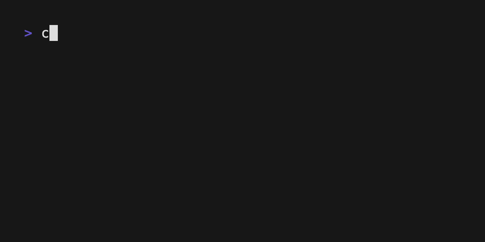

# Views



## Overview

This example demonstrates building a multi-view TUI application with smooth transitions between different interface states. It showcases navigation patterns, animated progress bars with custom gradients, and different timing patterns for various types of updates - essential concepts for building complex, user-friendly TUI applications.

## Key Features

- **Multi-View Navigation**: Seamless transitions between menu and progress views
- **Keyboard Navigation**: Arrow keys and vim-style navigation (j/k)
- **Animated Progress Bar**: Custom gradient rendering with bounce easing animation
- **Dual Timer System**: Different update frequencies for UI animation vs logic
- **Countdown Timers**: Auto-exit functionality with visual countdown
- **Custom Gradient Rendering**: Hand-built color interpolation system
- **State Management**: Clean separation between view states and transitions

## How It Works

The application presents two distinct views:

1. **Menu View**: A selectable list with countdown timer
2. **Progress View**: Animated loading with gradient progress bar

The key innovation is using two different message types with different timing:
- `TickMsg` (1 second intervals) - For countdown logic and state transitions
- `FrameMsg` (60fps intervals) - For smooth animation rendering

## Code Structure

### Model (`ViewsModel`)
- `choice: usize` - Currently selected menu item (0-3)
- `chosen: bool` - Whether user has made a selection (view state)
- `ticks: i32` - Countdown timer value
- `frames: i32` - Animation frame counter
- `progress: f64` - Progress bar completion (0.0-1.0)
- `loaded: bool` - Whether loading animation is complete

### Key Components

1. **Dual Update System**
   ```rust
   fn update(&mut self, msg: Msg) -> Option<Cmd> {
       if !self.chosen {
           self.update_choices(msg)  // Menu view logic
       } else {
           self.update_chosen(msg)   // Progress view logic
       }
   }
   ```

2. **Frame-Rate Animation**
   ```rust
   // 60fps animation for smooth progress
   tick(Duration::from_millis(1000 / 60), |_| {
       Box::new(FrameMsg) as Msg
   })
   
   // 1-second ticks for countdown logic
   tick(Duration::from_secs(1), |_| Box::new(TickMsg) as Msg)
   ```

3. **Bounce Easing Animation**
   ```rust
   fn ease_out_bounce(t: f64) -> f64 {
       let t = t.clamp(0.0, 1.0);
       
       if t < (1.0 / 2.75) {
           7.5625 * t * t
       } else if t < (2.0 / 2.75) {
           let t = t - (1.5 / 2.75);
           7.5625 * t * t + 0.75
       } else if t < (2.5 / 2.75) {
           let t = t - (2.25 / 2.75);
           7.5625 * t * t + 0.9375
       } else {
           let t = t - (2.625 / 2.75);
           7.5625 * t * t + 0.984375
       }
   }
   ```

4. **Custom Gradient Rendering**
   ```rust
   fn make_gradient_ramp(color_a: &str, color_b: &str, steps: usize) -> Vec<String> {
       let start_color = hex_to_rgb(color_a);
       let end_color = hex_to_rgb(color_b);
       
       let mut ramp = Vec::with_capacity(steps);
       
       for i in 0..steps {
           let t = i as f64 / (steps - 1) as f64;
           let r = (start_color.0 as f64 + (end_color.0 as f64 - start_color.0 as f64) * t).round() as u8;
           let g = (start_color.1 as f64 + (end_color.1 as f64 - start_color.1 as f64) * t).round() as u8;
           let b = (start_color.2 as f64 + (end_color.2 as f64 - start_color.2 as f64) * t).round() as u8;
           
           let hex_color = format!("#{:02x}{:02x}{:02x}", r, g, b);
           let style = Style::new().foreground(Color::from(hex_color.as_str()));
           ramp.push(style.render(&PROGRESS_FULL_CHAR.to_string()));
       }
       
       ramp
   }
   ```

## API Usage

### View State Management
```rust
let content = if !self.chosen {
    self.choices_view()   // Menu interface
} else {
    self.chosen_view()    // Progress interface
};
```

### Timer Commands with Different Frequencies
```rust
// Fast animation updates (60fps)
tick(Duration::from_millis(1000 / 60), |_| {
    Box::new(FrameMsg) as Msg
})

// Slow logic updates (1 second)
tick(Duration::from_secs(1), |_| Box::new(TickMsg) as Msg)
```

### Gradient Configuration
```rust
const PROGRESS_BAR_WIDTH: usize = 71;
const PROGRESS_FULL_CHAR: char = '█';
const PROGRESS_EMPTY_CHAR: char = '░';

// Create gradient from purple to green
let gradient_ramp = make_gradient_ramp("#B14FFF", "#00FFA3", PROGRESS_BAR_WIDTH);
```

## Running the Example

```bash
cd examples/views
cargo run
```

## Key Bindings

### Menu View
- **j** or **Down Arrow**: Move selection down
- **k** or **Up Arrow**: Move selection up
- **Enter**: Select current item and transition to progress view
- **q** or **Esc**: Quit immediately
- **Ctrl+C**: Force quit

### Progress View
- **q** or **Esc**: Quit immediately
- **Ctrl+C**: Force quit

## Implementation Notes

### Multi-Rate Update Pattern
This example demonstrates an important TUI pattern: using different message types for different update frequencies:

- **Logic updates** (TickMsg): 1 second intervals for countdown, state changes
- **Animation updates** (FrameMsg): 60fps for smooth visual effects

This prevents animation from being choppy while keeping logic updates at appropriate intervals.

### Custom Progress Bar Implementation
Rather than using a pre-built widget, this example implements a custom progress bar to demonstrate:
- Color interpolation between hex colors
- Character-by-character gradient rendering
- Progress calculation with clamping
- Integration with easing functions

### Bounce Easing Mathematics
The `ease_out_bounce` function implements the "OutBounce" easing curve, creating a realistic bouncing effect as the progress bar completes. This matches the behavior from animation libraries like `fogleman/ease`.

### State Transition Management
The application uses a simple boolean flag (`chosen`) to manage view states, but the pattern scales to more complex state machines:

```rust
fn update(&mut self, msg: Msg) -> Option<Cmd> {
    // Global actions (quit) handled first
    if self.should_quit(msg) {
        return Some(quit());
    }
    
    // Route to appropriate view handler
    match self.current_view {
        View::Menu => self.update_menu(msg),
        View::Progress => self.update_progress(msg),
        // Additional views...
    }
}
```

### Performance Considerations
- Gradient calculation is done once and cached in a vector
- Color interpolation uses integer math to avoid floating-point precision issues
- Frame updates only trigger when animation is active (`!self.loaded`)

This example serves as a template for building sophisticated multi-view TUI applications with smooth animations and responsive user interfaces.
